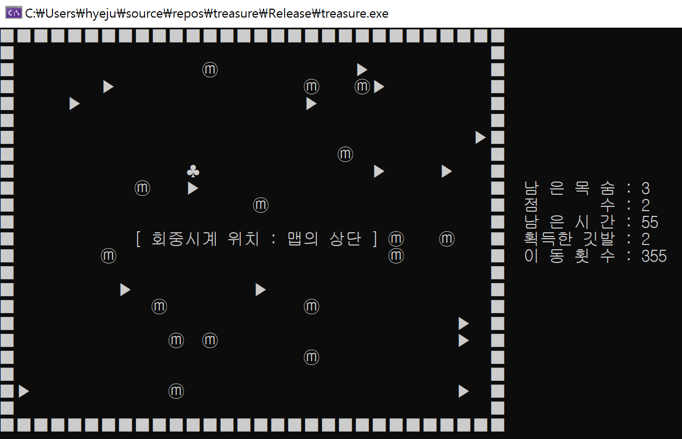

### 🕰️ **하얀 토끼의 회중시계 찾기 게임** 🎩🐇  

**"이상한 나라에서 펼쳐지는 흥미진진한 보물찾기!"**  

## 🎮 **게임 개요**  
앨리스는 원래의 세계로 돌아가기 위해 하얀 토끼를 찾았다. 하지만 하얀 토끼는 **잃어버린 회중시계를 찾아야 한다**고 한다.  
앨리스는 **클로버 병장 3명**에게 보물을 찾아달라고 부탁하고, 클로버 병장들은 **지뢰를 피해 깃발 아래 숨겨진 보물을 찾아야 한다!**  
과연 **시간 안에 회중시계를 찾아내고 무사히 탈출할 수 있을까?**  

---

## 🕹️ **게임 방식**  

### 🎯 **목표**  
✅ 여러 개의 깃발 중 **회중시계가 숨겨진 깃발**을 찾아라!  
✅ 방향키를 이용해 클로버 병장을 움직이며 **제한된 이동 횟수/시간 내에 보물을 찾아야 한다**  

### 📌 **게임 진행 방법**  
1️⃣ **게임 시작**  
   - 게임 메뉴에서 원하는 옵션을 선택 후 게임 시작  
   - 랜덤하게 배치된 **깃발들 중 하나에 보물(회중시계)이 숨겨져 있음**  

2️⃣ **깃발 탐색**  
   - 깃발을 선택하면 다양한 이벤트 발생  
     - ✅ **보물 찾기 성공 → 게임 승리** 🎉  
     - ❌ **지뢰 발견 → 클로버 병장 사망, 새로운 병장 등장** 💀  
     - 🔄 **제자리로 돌아가기, 깃발 초기화, 힌트 제공 등의 랜덤 이벤트**  

3️⃣ **투시 모드 활용 (스페이스바)**  
   - **투시 모드(안경 착용) 사용 시 깃발의 기능을 미리 확인 가능** 👓  

4️⃣ **게임 종료 조건**  
   - 제한된 **이동 횟수 또는 시간** 내에 보물을 찾으면 승리  
   - 보물을 찾지 못하고 기회가 끝나면 패배  

---

## 🔧 **주요 기능**  
- **2차원 배열을 이용한 게임 맵 랜덤 생성**  
- **기호 상수 활용** → 코드 유지보수 및 수정 용이  
- **포인터를 이용한 그래픽 요소 및 문자열 출력 최적화**  
- **함수 분리로 가독성 향상 및 모듈화된 코드 구성**  
- **메뉴 시스템을 통한 다양한 옵션 선택 가능**  
- **반복 실행 가능 (사용자가 직접 종료 선택)**  

---

## 🎥 **게임 플레이 영상**  
  

---

## 💻 **기술 스택**  
✅ **C 프로그래밍**  
✅ **2차원 배열 및 포인터 활용**  
✅ **게임 로직 및 랜덤 이벤트 구현**  

👉 **하얀 토끼의 회중시계를 찾아 모험을 떠나보세요!** 🕰️🐇✨  
